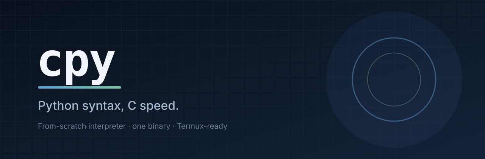
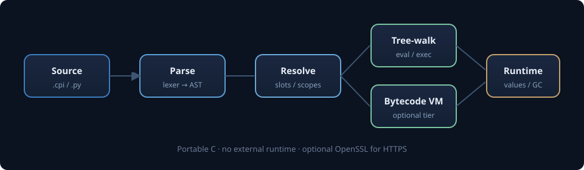

<p align="center">
  
</p>

<p align="center">
  <strong>Python-compatible syntax. From-scratch C interpreter. One binary.</strong><br/>
  Classes, generators, async, networking — no CPython, no GC pauses, Termux-ready.
</p>

<p align="center">
  <a href="https://github.com/MoonLite-Br/Cpy/actions"></a>
  
  
  
  
</p>

---

## Why cpy?

| | CPython | **cpy** |
|---|---|---|
| Implementation | Large C + huge stdlib | ~10k lines of portable C |
| Dependencies | Build toolchain + many libs | `cc` + `make` (OpenSSL optional) |
| Binary | System install | **Single static-friendly binary** |
| Local variables | Dict lookup | **Resolved to array slots at parse time** |
| Generators | Frame objects | **Userspace stack switch** (ucontext / sigaltstack) |
| Target | Desktops & servers | **PC, server, and phone (Termux)** |

On the benchmarks in `tests/`, tight loops, string building, list/dict work and attribute access are typically **1.2×–50× faster** than CPython 3.12. Call-heavy recursion (`fib(30)`) is about on par. cpy is not a JIT — it will not beat PyPy — but for scripts, glue, and small tools it is fast, small, and simple to ship.

## Quick start

```bash
# Debian/Ubuntu
sudo apt install build-essential libssl-dev   # libssl-dev optional (HTTPS)

# Termux
pkg install clang make openssl

git clone https://github.com/MoonLite-Br/Cpy.git
cd Cpy
./install.sh          # → cpy on your PATH
# or just: make && ./bin/cpy
```

```bash
cpy                     # interactive REPL
cpy script.cpi          # run a file (.cpi, .cpy, or .py)
cpy -c 'print(1 + 2)'
cpy --version
```

## Example

```python
from collections import Counter

class Greeter:
    def __init__(self, name):
        self.name = name
    def greet(self):
        return f"Hello, {self.name}!"

for who in ["world", "cpy"]:
    print(Greeter(who).greet())

def fib():
    a, b = 0, 1
    while True:
        yield a
        a, b = b, a + b

print([n for _, n in zip(range(10), fib())])
print(Counter("mississippi").most_common(2))
```

More samples in [`examples/`](examples/): algorithms, classes, word count, fib.

## Architecture

<p align="center">
  
</p>

1. **Lexer / parser** — builds an AST from Python-like source  
2. **Resolver** — binds locals to fixed slots (no per-access dict lookup)  
3. **Execution** — tree-walker by default; optional register bytecode VM on hot functions  
4. **Runtime** — refcounted values, generators via userspace stack switch, built-in modules embedded in the binary  

## Features

**Language**
- Classes with multiple inheritance and C3 MRO  
- `@decorator`, `@property` / `@staticmethod` / `@classmethod`  
- `*args` / `**kwargs` / keyword-only parameters  
- Generators: `yield`, `yield from`, `.send` / `.throw` / `.close`  
- List / set / dict / generator comprehensions  
- f-strings (including `f"{x=}"`), walrus `:=`, star-unpacking  
- `with` (multiple managers), `try` / `except` / `else` / `finally`  
- Packages and relative imports  
- `async` / `await` with a cooperative `asyncio`-style event loop  

**Types**
- `int` (64-bit) · `float` · `str` (UTF-8) · `bool`  
- `list` · `tuple` · `dict` · `set` · `frozenset` · `range`  

**Batteries (in-binary)**  
`math` · `random` · `time` · `sys` · `os` / `os.path` · `collections` · `itertools` · `functools` · `operator` · `heapq` · `bisect` · `string` · `json` · `socket` · `urllib` · `ssl` (when OpenSSL is present)

**Extras**
- REPL with multi-line blocks and persistent state  
- Tracebacks with file / line / function  
- `read("file")` / `write("file", text)` conveniences  
- Optional AOT path under [`selfhost/`](selfhost/) (compile numeric cpy → native via generated C)

## Install options

```bash
./build.sh              # build only → bin/cpy
./install.sh            # build + install to $PREFIX/bin, /usr/local/bin, or ~/bin
make                    # same as build
make debug              # AddressSanitizer + UBSan binary → bin/cpy-asan
make test               # full test suite
```

HTTPS: if OpenSSL headers/libs are installed, `make` enables them automatically. Without them, cpy still builds; `http://` works, `https://` reports a clear error.

## CLI

```
cpy [options] [script.cpi [args...]]
cpy -c "code"

  -c CODE       run CODE and exit
  -i            force REPL
  --no-vm       tree-walker only (or CPY_NOVM=1)
  -h, --help
  -V, --version

Module search path: CPY_PATH=dir1:dir2
```

## Differences from CPython

| Area | cpy behavior |
|------|----------------|
| `int` | 64-bit; overflow → `OverflowError` (no bigint) |
| Bytes | no `bytes` / `bytearray` |
| Numbers | no `complex` |
| Syntax | no `match` / `case` |
| Objects | no `__slots__`; metaclasses limited to 3-arg `type(...)` |
| Concurrency | cooperative `async` only (no OS threads for user code) |

Syntax that *is* shared is exercised against CPython 3.12 in the test suite (`tests/compare_python.sh`).

## Project layout

```
src/              interpreter (C)
examples/         sample programs
tests/            conformance + VM + net + async suites
selfhost/         cpy-in-cpy interpreter + AOT compiler sketch
assets/           logos / diagrams
.github/          CI (Linux x86_64, sanitizers)
```

## Tests

```bash
make test
make debug && CPY=./bin/cpy-asan ASAN_OPTIONS=detect_leaks=0 ./run_tests.sh
./selfhost_test.sh          # native vs self-hosted interpreter
```

## License

[MIT](LICENSE) © 2026 moonlite-admin

---

<p align="center">
  
</p>
